Listed directory routes
Listed directory core
Listed directory router
Viewed router.dart:1-47
Viewed redirect_gate.dart:1-52
Listed directory router_state
Viewed router_state_provider.dart:1-44
Viewed riverpod_extensions.dart:1-42

Here is the complete architectural walkthrough of how [TokenManager](file:///c:/flutter_my_projects/flutter_app_template/lib/src/data/services/network/auth/token_manager.dart#L18), [RouterRepository](file:///c:/flutter_my_projects/flutter_app_template/lib/src/domain/repositories/router_repository.dart), and [GoRouter](file:///c:/flutter_my_projects/flutter_app_template/lib/src/presentation/core/router/router.dart#L30) cooperate to achieve **reactive, state-driven screen navigation** without imperative routing calls.

---

### 1. High-Level Architecture & Layer Responsibility

```text
 ┌─────────────────────────────────────────────────────────────────┐
 │                          TokenManager                           │
 │  • Emits on `sessionStream` (true on save, false on clear)      │
 │  • Checks refreshToken presence for active session              │
 └────────────────────────────────┬────────────────────────────────┘
                                  │ reads / streams
                                  ▼
 ┌─────────────────────────────────────────────────────────────────┐
 │                      RouterRepositoryImpl                       │
 │  • Bridges TokenManager (session) + CacheService (onboarding)   │
 └────────────────────────────────┬────────────────────────────────┘
                                  │ observed by
                                  ▼
 ┌─────────────────────────────────────────────────────────────────┐
 │                      sessionStatusProvider                      │
 │  • StreamProvider: yields authenticated vs unauthenticated      │
 └────────────────────────────────┬────────────────────────────────┘
                                  │ watched by
                                  ▼
 ┌─────────────────────────────────────────────────────────────────┐
 │                       routerStateProvider                       │
 │  • Pure composite state: combines Startup + Onboarding + Session│
 │  • Output: active target gate (splash / onboarding / login / home)
 └────────────────────────────────┬────────────────────────────────┘
                                  │ ref.asListenable() (ValueNotifier)
                                  ▼
 ┌─────────────────────────────────────────────────────────────────┐
 │                    GoRouter & RedirectGate                      │
 │  • `refreshListenable`: re-evaluates routes on state change     │
 │  • `RedirectGate.redirect()`: pure function redirects or allows │
 └─────────────────────────────────────────────────────────────────┘
```

---

### 2. Step-by-Step Modular Workflow

```text
┌─────────────────────────────────────────────────────────────────────────────────────────────────────────────┐
│ 1. AUTH EVENT & STREAM EMISSION                                                                             │
│                                                                                                             │
│  ┌───────────────────────────┐   saveTokens(access, refresh)   ┌───────────────────────────┐                │
│  │   Auth / Refresh Action   │ ──────────────────────────────► │       TokenManager        │                │
│  │    (Login / 401 Clear)    │ ◄────────────────────────────── │  _sessionController.add   │                │
│  └───────────────────────────┘          clearSession()         └─────────────┬─────────────┘                │
│                                                                              │                              │
│                                                                              ▼ emits bool (true / false)    │
└──────────────────────────────────────────────────────────────────────────────┼──────────────────────────────┘
                                                                               │
                                                                               ▼
┌─────────────────────────────────────────────────────────────────────────────────────────────────────────────┐
│ 2. REACTIVE STATE BRIDGING                                                                                  │
│                                                                                                             │
│  ┌───────────────────────────┐    yields SessionStatus         ┌───────────────────────────┐                │
│  │   RouterRepositoryImpl    │ ──────────────────────────────► │   sessionStatusProvider   │                │
│  │ (exposes sessionStream)   │                                 │ (StreamProvider<Status>)  │                │
│  └───────────────────────────┘                                 └─────────────┬─────────────┘                │
│                                                                              │                              │
│                                                                              ▼ AsyncData(authenticated/unauth)
└──────────────────────────────────────────────────────────────────────────────┼──────────────────────────────┘
                                                                               │
                                                                               ▼
┌─────────────────────────────────────────────────────────────────────────────────────────────────────────────┐
│ 3. COMPOSITE GATE EVALUATION & REFRESH NOTIFICATION                                                         │
│                                                                                                             │
│  ┌───────────────────────────┐   startup / onboard / session   ┌───────────────────────────┐                │
│  │    routerStateProvider    │ ──────────────────────────────► │     ref.asListenable()    │                │
│  │ (pure Provider<Routes>)   │                                 │ (Bridges to ValueNotifier)│                │
│  └───────────────────────────┘                                 └─────────────┬─────────────┘                │
│                                                                              │                              │
│                                                                              ▼ signals refreshListenable    │
└──────────────────────────────────────────────────────────────────────────────┼──────────────────────────────┘
                                                                               │
                                                                               ▼
┌─────────────────────────────────────────────────────────────────────────────────────────────────────────────┐
│ 4. PURE REDIRECT GATE EXECUTION                                                                             │
│                                                                                                             │
│  ┌───────────────────────────┐    evaluates path vs gate       ┌───────────────────────────┐                │
│  │    GoRouter.redirect      │ ──────────────────────────────► │   RedirectGate.redirect   │                │
│  │  (intercepts transition)  │ ◄────────────────────────────── │ (returns destination/null)│                │
│  └─────────────┬─────────────┘                                 └───────────────────────────┘                │
│                │                                                                                            │
│                ▼ smoothly pushes target screen                                                              │
│  ┌──────────────────────────────────────────────────────────────────────────────┐                          │
│  │ Unauthenticated: Allowed on Auth Flow (/login, /register), else → /login     │                          │
│  │ Authenticated:   Allowed on Shell (/home, /chat), Gate-only paths → /home    │                          │
│  └──────────────────────────────────────────────────────────────────────────────┘                          │
└─────────────────────────────────────────────────────────────────────────────────────────────────────────────┘
```

---

### 3. Detailed Sequence Diagram

```mermaid
sequenceDiagram
    autonumber
    actor User as User / App Lifecycle
    participant TM as TokenManager
    participant RR as RouterRepositoryImpl
    participant SSP as sessionStatusProvider
    participant RSP as routerStateProvider
    participant Listen as ref.asListenable (ValueNotifier)
    participant RG as RedirectGate
    participant GR as GoRouter / Navigator

    %% Scenario A: Initial Boot & Login
    rect rgb(28, 33, 40)
        Note over User,GR: Scenario 1: Initial App Launch & Successful Authentication
        User->>GR: Opens App (initialLocation: /splash)
        RSP->>SSP: ref.watch(sessionStatusProvider)
        SSP->>RR: repository.hasSession()
        RR->>TM: tokens.refreshToken
        TM-->>RR: null (no session)
        SSP-->>RSP: AsyncData(SessionStatus.unauthenticated)
        RSP-->>Listen: Returns Routes.login
        Listen->>GR: Notify refreshListenable
        GR->>RG: RedirectGate.redirect(path: "/splash", gate: Routes.login)
        RG-->>GR: Returns "/login"
        GR->>User: Displays LoginScreen
    end

    %% Scenario B: User Logs in
    rect rgb(20, 36, 28)
        Note over User,GR: Scenario 2: User Submits Login Credentials
        User->>TM: saveTokens(access: "...", refresh: "...")
        TM->>TM: _sessionController.add(true)
        TM-->>RR: sessionStream emits `true`
        RR-->>SSP: sessionStatusProvider yields SessionStatus.authenticated
        SSP-->>RSP: routerStateProvider recalculates -> Routes.homeScreen
        RSP-->>Listen: ValueNotifier updates to Routes.homeScreen
        Listen->>GR: Trigger router refresh
        GR->>RG: RedirectGate.redirect(path: "/login", gate: Routes.homeScreen)
        Note over RG: "/login" is a Gate-Only path -> redirect to "/home_screen"
        RG-->>GR: Returns "/home_screen"
        GR->>User: Displays HomeScreen (BottomNavBar Shell)
    end

    %% Scenario C: Logout / Refresh Failure
    rect rgb(38, 24, 24)
        Note over User,GR: Scenario 3: Token Invalidation or Logout
        User->>TM: clearSession()
        TM->>TM: _sessionController.add(false)
        TM-->>RR: sessionStream emits `false`
        RR-->>SSP: sessionStatusProvider yields SessionStatus.unauthenticated
        SSP-->>RSP: routerStateProvider recalculates -> Routes.login
        RSP-->>Listen: ValueNotifier updates to Routes.login
        Listen->>GR: Trigger router refresh
        GR->>RG: RedirectGate.redirect(path: "/home_screen", gate: Routes.login)
        Note over RG: "/home_screen" is protected -> redirect to "/login"
        RG-->>GR: Returns "/login"
        GR->>User: Auto-navigates back to LoginScreen
    end
```



---

### 4. Key Mechanisms & Architectural Rules

#### 1. Zero Imperative Navigation in Repositories
Screens and repositories never call `context.go('/home_screen')` or `context.go('/login')` directly upon login/logout. They only mutate the auth state in [TokenManager](file:///c:/flutter_my_projects/flutter_app_template/lib/src/data/services/network/auth/token_manager.dart#L18). The routing system reacts downstream automatically.

#### 2. Clean Riverpod-to-GoRouter Bridge ([riverpod_extensions.dart#L18](file:///c:/flutter_my_projects/flutter_app_template/lib/src/core/extensions/riverpod_extensions.dart#L18))
`GoRouter` natively requires a `Listenable` to know when to re-run redirects. [RefAsListenable.asListenable](file:///c:/flutter_my_projects/flutter_app_template/lib/src/core/extensions/riverpod_extensions.dart#L18) subscribes to [routerStateProvider](file:///c:/flutter_my_projects/flutter_app_template/lib/src/presentation/core/router/router_state/router_state_provider.dart#L24) and proxies changes through a `ValueNotifier`, avoiding memory leaks by tying subscriptions to provider disposal.

#### 3. Pure, Testable Redirect Policy ([redirect_gate.dart#L6](file:///c:/flutter_my_projects/flutter_app_template/lib/src/presentation/core/router/redirect_gate.dart#L6))
[RedirectGate.redirect](file:///c:/flutter_my_projects/flutter_app_template/lib/src/presentation/core/router/redirect_gate.dart#L22) contains no Flutter widget or Riverpod dependencies:
* **Auth-Flow Whitelist**: When `Routes.login` is the active gate, users can freely navigate between `/login`, `/register_screen`, `/reset_pass_screen`, `/email_verification_screen`, and `/create_new_pass_screen`.
* **Gate-Only Path Protection**: When `Routes.homeScreen` is the active gate, users trying to revisit `/splash`, `/onboarding`, or `/login` are automatically redirected to `/home_screen`.
* **Idempotency**: If `path == targetPath`, it returns `null`, preventing infinite redirect recursion.

#### 4. Composite Gate Evaluation ([router_state_provider.dart#L24](file:///c:/flutter_my_projects/flutter_app_template/lib/src/presentation/core/router/router_state/router_state_provider.dart#L24))
The router evaluates a hierarchy of preconditions:
```dart
// 1. Splash Gate (while booting or loading locale)
if (startup.isLoading || startup.hasError) return Routes.splash;

// 2. Onboarding Gate (first launch walkthrough)
if (!ref.watch(onboardingStatusProvider)) return Routes.onboarding;

// 3. Auth Gate (session presence)
return switch (session) {
  AsyncData(value: SessionStatus.authenticated) => Routes.homeScreen,
  AsyncData() => Routes.login,
  _ => Routes.splash,
};
```